# Background

Morphological traits can evolve independently or they can have a correlation between them. The correlated substitution model of  allows us to determine whether traits are indeed correlated or not.

In this tutorial, we will look at the correlation between stratification of society and human sacrifice  in Austronesian cultures.

----

# Programs used in this Exercise

### BEAST2 - Bayesian Evolutionary Analysis Sampling Trees 2

BEAST2 is a free software package for Bayesian evolutionary analysis of molecular sequences using MCMC and strictly oriented toward inference using rooted, time-measured phylogenetic trees . This tutorial uses the BEAST2 version 2.7.4.

### BEAUti2 - Bayesian Evolutionary Analysis Utility

BEAUti2 is a graphical user interface tool for generating BEAST2 XML configuration files.

Both BEAST2 and BEAUti2 are Java programs, which means that the exact same code runs on all platforms. For us it simply means that the interface will be the same on all platforms. The screenshots used in this tutorial are taken on a Mac OS X computer; however, both programs will have the same layout and functionality on both Windows and Linux. BEAUti2 is provided as a part of the BEAST2 package so you do not need to install it separately.

### Tracer

Tracer is used to summarise the posterior estimates of the various parameters sampled by the Markov Chain. This program can be used for visual inspection and to assess convergence. It helps to quickly view median estimates and 95% highest posterior density intervals of the parameters, and calculates the effective sample sizes (ESS) of parameters. It can also be used to investigate potential parameter correlations. We will be using Tracer v1.7.0.

----

# Practical: Correlated Evolution

We will set up an analysis in BEAUti using a fixed tree partition. We add two traits: one for stratification of society and the other for having human sacrifice or not. We will be using the FixedTreeAnalysis and CorrelateTrait packages. For post-processing, we will use the Babel package.

> * Start BEAUti
> * Click to the `File => Manage packages` menu item.
> * Select `FixedTreeAnalysis` in the list of packages and the click `Install` button.
> * Select `CorrelateTrait` and the click `Install` button (this installs the BEASTLabs, BEAST-classic and Babel packages as well if not already installed).
> * Close BEAUti -- it needs to restart to pick up the new packages.


## Set up in BEAUti

> Start BEAUti and select the `File => Templates => Fixed Tree Analysis` item

BEAUti should change to show it uses the Fixed Tree Analysis template.

<figure>
	<a id="fig:BEAUti1"></a>
	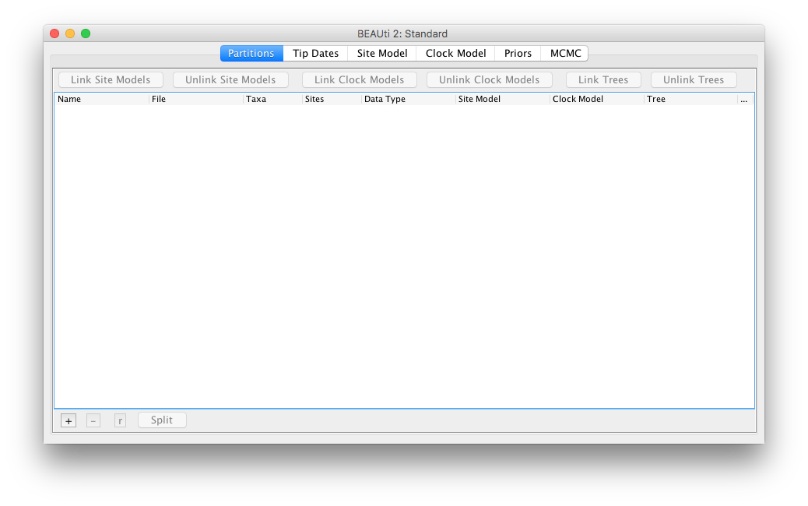
	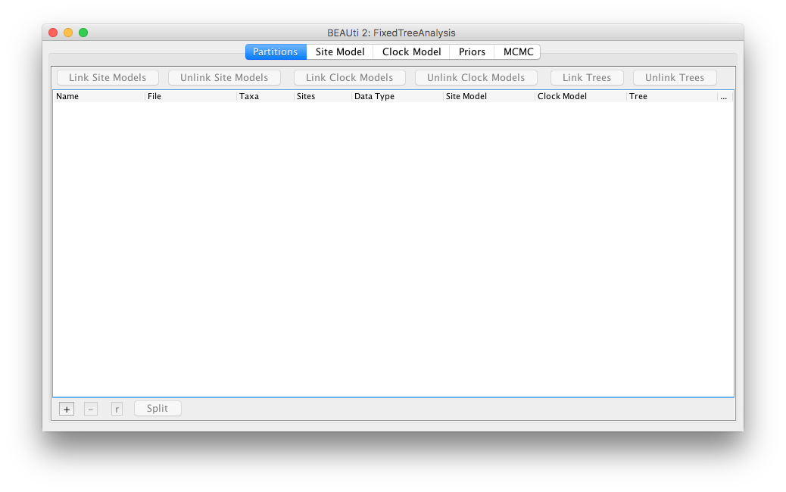
	<figcaption>Figure 1: Select the Fixed Tree Analysis template, and BEAUti changes its appearance.</figcaption>
</figure>


> Next, select the `File => Import Fixed Tree` menu.
A dialog is shown where you can select a file containing a tree set in NEXUS format.

> Select the file `austronesia91.trees` that comes with this tutorial in the data section.

<figure>
	<a id="fig:BEAUti2"></a>
	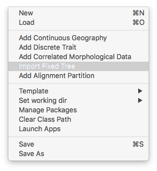
	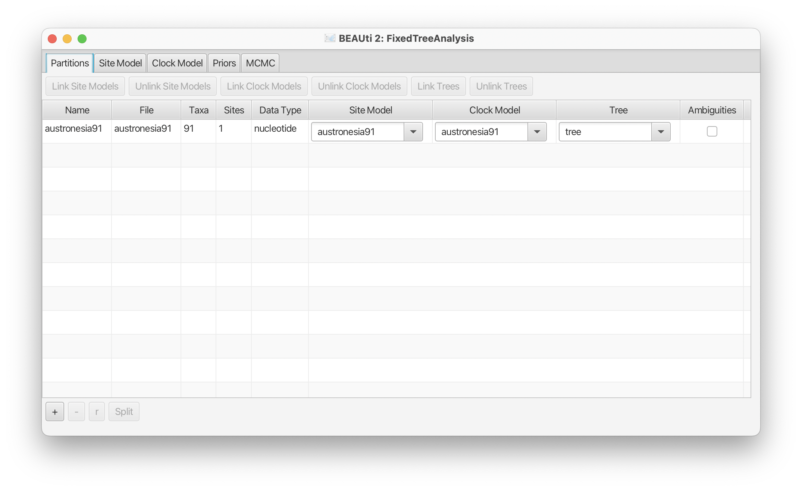
	<figcaption>Figure 2: Add fixed tree partition through the `File => Import Fixed Set` menu.</figcaption>
</figure>

In the partition panel, a new partition will be added with the name austronesia91 over 91 taxa. We will use the fixed tree as is, and won't need to change anything in the other tabs. We will add another partition for correlated morphological data.

> Select the `File => Add Correlated Morphological Data` menu.

<figure>
	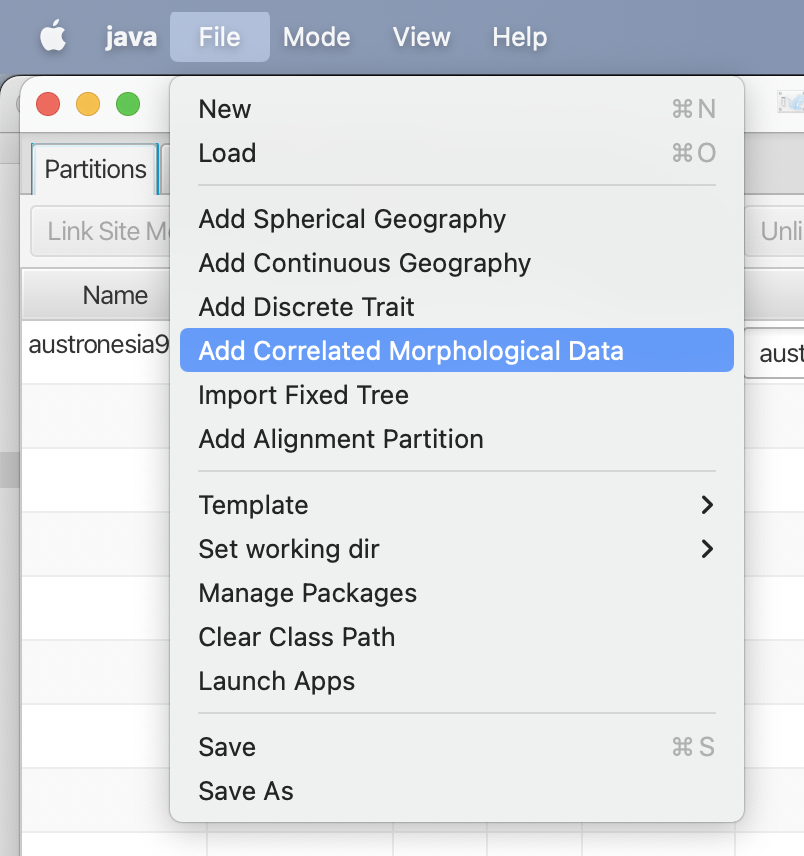
</figure>

A dialog is shown to set up the name. Choose something appropriate like `StratSacr`. There is only a single tree in the system, so no need to change it. 

<figure>
	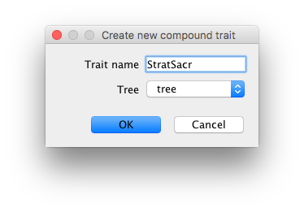
</figure>

Next, a file dialog shows up. Select the file `data.tsv` that comes with the tutorial. It is a tab-separated file containing three columns: the first contains taxon names, the second the values of the first trait, and the third, values of the second trait. If taxa from the fixed tree do not match, you can expect a warning, and have to fix the data file before continuing.

Next, a dialog is shown where you can edit the traits. The bottom shows two columns of values where you can choose the values you can map onto.

> * uncheck the `MidStrat` entry.
> * check the `HumanSacrifice` entry.
> * uncheck the `NoHumanSacrifice` entry.

This ensures values `LowStrat` and `MidStrat` are mapped to 0, and `HightStrat` to 1. Likewise, `HumanSacrifice` will be mapped to 1 for the second trait, and `NoHumanSacrifice` to 0.

<figure>
	<a id="fig:BEAUti3"></a>
	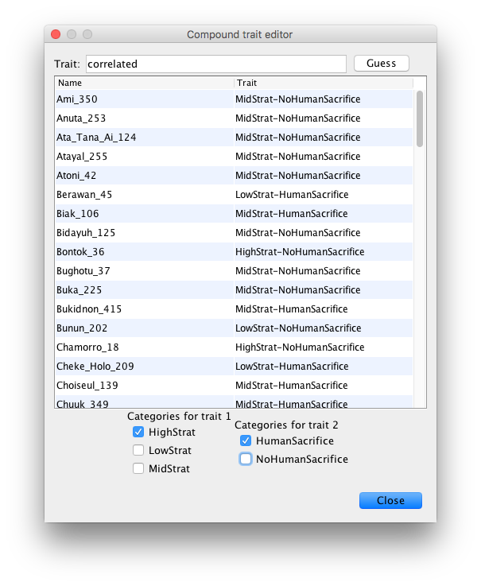
	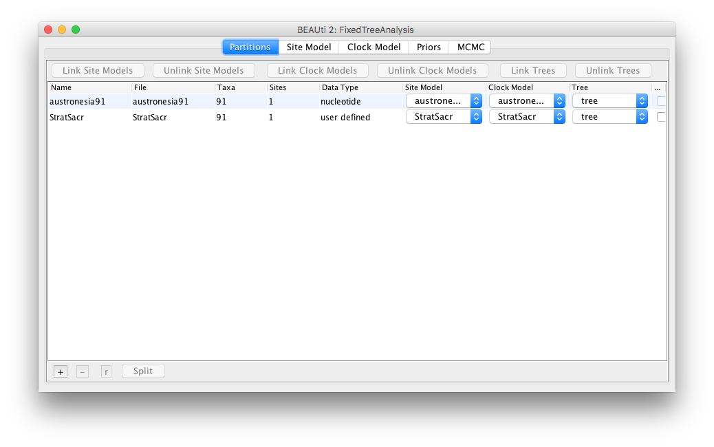
	<figcaption>Figure 3: Set up traits. A new partition will be added.</figcaption>
</figure>

A second partition should now have been added to the partitions panel. If you double click the partition, you can bring up the trait dialog editor again.

If necessary, the site model and its parameters can be changed in the site model panel, and the clock model in the clock model panel for the geography partition. For this tutorial, we will keep the site and clock model unchanged. However, note that the tree has a height of about 5 (millennia), which means that if the clock rate is less more than 1/5 the tree would be saturated. So, we set an upper bound of 1/5 on the clock rate in the priors panel, like so:

> * In the Priors panel, click on the `initial=...` button for the `clockRate`.
> * A dialog pops up with properties of the parameter. Set the `Upper` value to 0.2.
> * Now the start value (default 1.0) is out of range, so change `Value` to 0.1.
> * Click OK. The vales in the `initial` button should reflect your changes.

<figure>
	<a id="fig:BEAUti4"></a>
	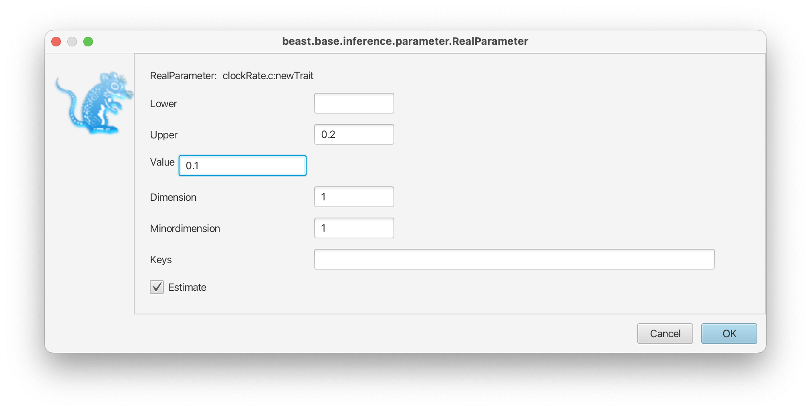
	<figcaption>Figure 4: Set up an upper bound for the clock rate.</figcaption>
</figure>


Since the analysis will converge quite quickly, we do not need the default 10 million samples.

> * In the MCMC panel, set the chainLength to 1 million samples.
> * Optionally, you might want to reduce the log frequency of the screen logger to 10000.
> * Safe the file to `StratSacr.xml`

<figure>
	<a id="fig:BEAUti5"></a>
	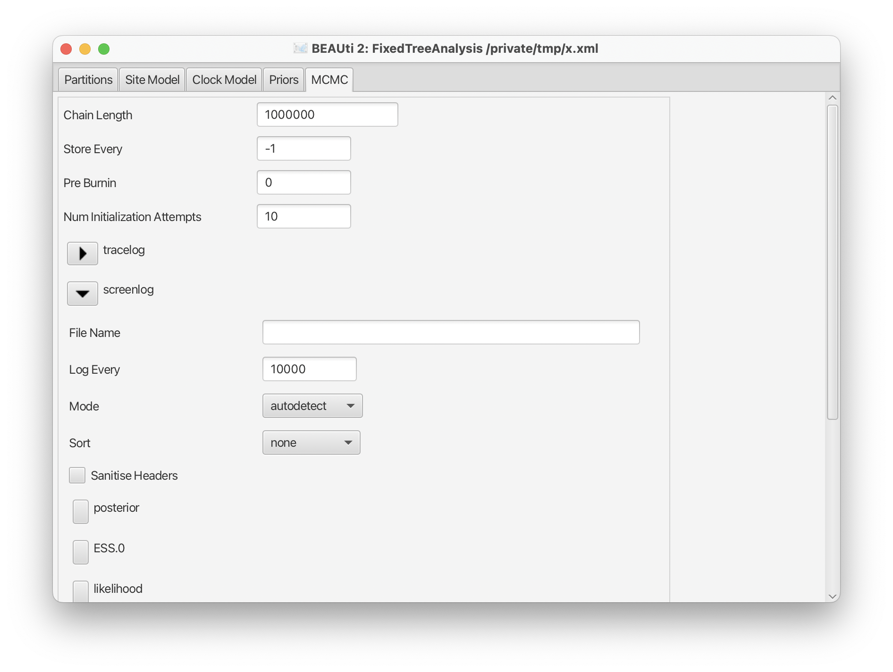
	<figcaption>Figure 5: MCMC settings.</figcaption>
</figure>


## Run with BEAST

> Run BEAST on `StratSacr.xml`

This should not take too long.

## Check convergence

> Run `Tracer`, and make sure all parameters have sufficiently large ESSs

<figure>
	<a id="fig:Tracer"></a>
	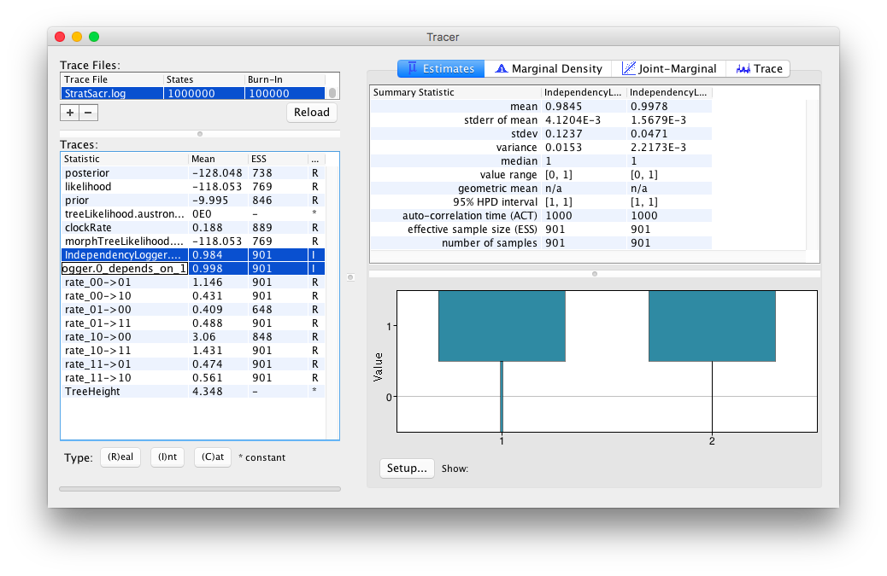
	<figcaption>Figure 6: Convergence of MCMC in Tracer.</figcaption>
</figure>

Things are looking good. The two entries `IndependencyLogger.1_depends_on_0` and 
`IndependencyLogger.0_depends_on_1` indicate whether the two traits are evolving independently or not. Both are over 98%, indicating high dependency. 

## Visualising rates

To visualise the rates, run the `RateMatrixVisualiser` app.

> * In BEAUti, select the `File => Launch Apps` menu.
> * Select the RateMatrixVisualiser icon and click the `launch` button.
> * Select the trace log file `StratSacr.log` and set output to `rates.svg`.
> * Click OK. The file `rates.svg` should have been written, which you can open in a web browser or drawing program.

(If you prefer a command line interface, you can do the same in a terminal using
`applauncher -in StarSacr.log -b 10 -out rates.svg`.)

<figure>
	<a id="fig:Tracer"></a>
	
	
	<figcaption>Figure 7: Visualising correlated rates with `RateMatrixVisualiser`.</figcaption>
</figure>

The state 00 is for both traits being 0 (i.e. not selected when you set up the traits), so that is low-stratification and no human sacrifice.

```
Is it obvious from the rates that the traits are dependent?
What else can you tell from the rates?
```

Be aware that rate estimates can be very sensitive to the tree, the taxa that were sampled. You might want to look at a number of random taxon sub-samples to see how sensitive rate estimates are. The simplest way to do this is by replacing the trait data with question marks, which ensures the branches without data will not have an impact on rate estimates.


## Visualising the tree

Note there are two tree logs. Only `StratSacr_tree_with_trait.trees` has the ancestral reconstruction logged in it, so that is what we will look at.

> * run `treeannotator` (which comes with BEAST) on the file `StratSacr_tree_with_trait.trees` to create an MCC tree.
> * run `figtree` on the MCC tree.
> * Select `node shapes`, open the `node shapes` tab and increase the size to 7, and select `correlated` in the `Colour by` drop down box. Internal nodes should now be coloured by their reconstruction.


<figure>
	<a id="fig:mcc"></a>
	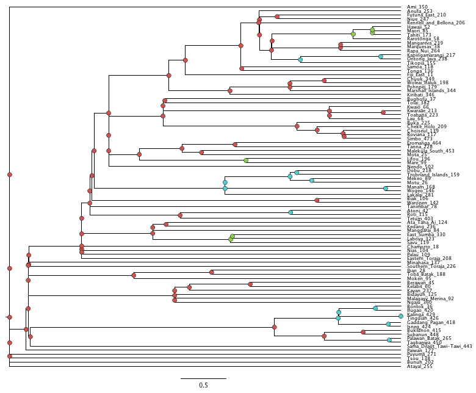
	<figcaption>Figure 7: Visualising the tree.
	Purple = high stratification, no human sacrifice,
	Green = high stratification, human sacrifice,
	Red = low/mid stratification, human sacrifice,
	Blue = low/mid stratification, no human sacrifice.
	</figcaption>
</figure>

If you want indication of the probability distribution, you can use the R package ggtree to add pie charts or other fancy visualisations.


```
What happens if you do not enforce an upper bound on the clock rate?
What would you consider a reasonable range for the clock rate?
```


```
You can run the analysis with just a single trait using the `File/Add discrete triat` menu in BEAUti. 
Does such an independent analysis result in a different reconstruction?
```


----
# Useful Links

- BEAST 2 website and documentation: [http://www.beast2.org/](http://www.beast2.org/)
- [Bayesian Evolutionary Analysis with BEAST 2](http://www.beast2.org/book.html) 
- Join the BEAST user discussion: [http://groups.google.com/group/beast-users](http://groups.google.com/group/beast-users)

----

# Relevant References


