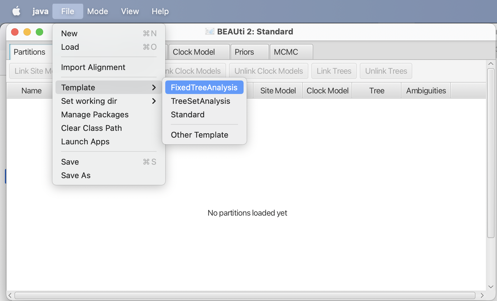
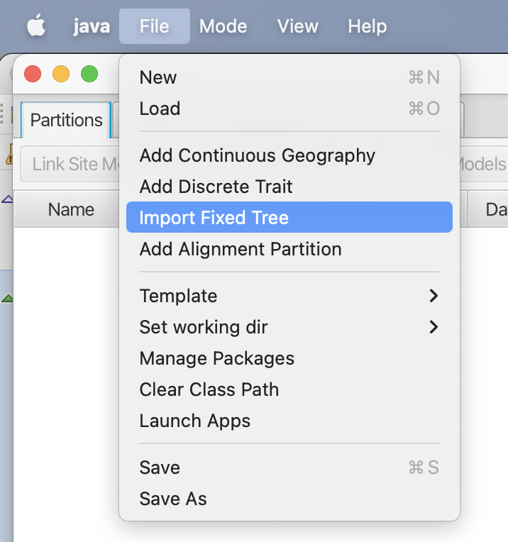
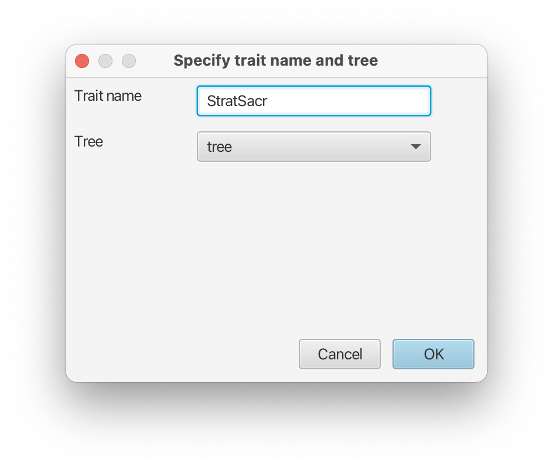
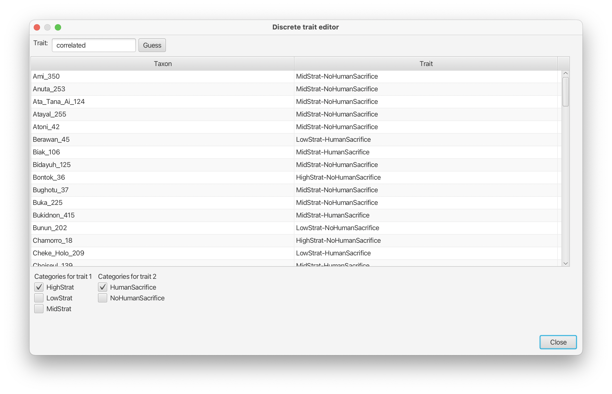

# Background

Morphological traits can evolve independently or they can have a correlation between them. The correlated substitution model of  allows us to determine whether traits are indeed correlated or not.

In this tutorial, we will look at the correlation between stratification of society and human sacrifice  in Austronesian cultures.

----

# Programs used in this Exercise

### BEAST2 - Bayesian Evolutionary Analysis Sampling Trees 2

BEAST2 is a free software package for Bayesian evolutionary analysis of molecular sequences using MCMC and strictly oriented toward inference using rooted, time-measured phylogenetic trees . This tutorial uses the BEAST2 version 2.6.3.

### BEAUti2 - Bayesian Evolutionary Analysis Utility

BEAUti2 is a graphical user interface tool for generating BEAST2 XML configuration files.

Both BEAST2 and BEAUti2 are Java programs, which means that the exact same code runs on all platforms. For us it simply means that the interface will be the same on all platforms. The screenshots used in this tutorial are taken on a Mac OS X computer; however, both programs will have the same layout and functionality on both Windows and Linux. BEAUti2 is provided as a part of the BEAST2 package so you do not need to install it separately.

### Tracer

Tracer is used to summarise the posterior estimates of the various parameters sampled by the Markov Chain. This program can be used for visual inspection and to assess convergence. It helps to quickly view median estimates and 95% highest posterior density intervals of the parameters, and calculates the effective sample sizes (ESS) of parameters. It can also be used to investigate potential parameter correlations. We will be using Tracer v1.7.0.

----

# Practical: Correlated Evolution

We will set up an analysis in BEAUti using a fixed tree partition. We add two traits: one for stratification of society and the other for having human sacrifice or not. We will be using the FixedTreeAnalysis and TreeSetAnalysis packages. For post-processing, we will use the Babel package.

> * Start BEAUti
> * Click to the `File => Manage packages` menu item.
> * Select `FixedTreeAnalysis` in the list of packages and the click `Install` button.
> * Select `TreeSetAnalysis` and the click `Install` button.
> * Select `Babel` and the click `Install` button.
> * Close BEAUti -- it needs to restart to pick up the new packages.

## Set up in BEAUti

> Start BEAUti and select the `File => Templates => Fixed Tree Analysis` item

BEAUti should change to show it uses the Fixed Tree Analysis template.

<figure>
	
	
	
	<figcaption>Figure 1: Select the Tree Set Analysis template, and BEAUti changes its appearance.</figcaption>
</figure>

> Next, select the `File => Import Fixed Tree` menu.
A dialog is shown where you can select a file containing a tree set in NEXUS format.

> Select the file `austronesia91.trees` that comes with this tutorial in the data section.

<figure>
	
	
	
	<figcaption>Figure 2: Add fixed tree partition through the `File => Import Fixed Set` menu.</figcaption>
</figure>

In the partition panel, a new partition will be added with the name austronesia91 over 91 taxa. We will use the fixed tree as is, and won't need to change anything in the other tabs. We will add another partition for correlated morphological data.

> Select the `File => Add Correlated Morphological Data` menu.

<figure>
	
</figure>

A dialog is shown to set up the name. Choose something appropriate like `StratSacr`. There is only a single tree in the system, so no need to change it. 

<figure>
	
</figure>

Next, a file dialog shows up. Select the file `data.tsv` that comes with the tutorial. It is a tab-separated file containing three columns: the first contains taxon names, the second the values of the first trait, and the third, values of the second trait. If taxa from the fixed tree do not match, you can expect a warning, and have to fix the data file before continuing.

Next, a dialog is shown where you can edit the traits. The bottom shows two columns of values where you can choose the values you can map onto.

> * uncheck the `MidStrat` entry.
> * check the `HumanSacrifice` entry.
> * uncheck the `NoHumanSacrifice` entry.

This ensures values `LowStrat` and `MidStrat` are mapped to 0, and `HightStrat` to 1. Likewise, `HumanSacrifice` will be mapped to 1 for the second trait, and `NoHumanSacrifice` to 0.

<figure>
	
	
	
	<figcaption>Figure 3: Set up traits. A new partition will be added.</figcaption>
</figure>

A second partition should now have been added to the partitions panel. If you double click the partition, you can bring up the trait dialog editor again.

If necessary, the site model and its parameters can be changed in the site model panel, and the clock model in the clock model panel for the geography partition. For this tutorial, we will keep the site and clock model unchanged.

Since the analysis will converge quite quickly, we do not need the default 10 million samples.

> * In the MCMC panel, set the chainLength to 1 million samples.
> * Optionally, you might want to reduce the log frequency of the screen logger to 100000.
> * Safe the file to `StratSacr.xml`

<figure>
	
	
	<figcaption>Figure 4: MCMC settings.</figcaption>
</figure>

## Run with BEAST

> Run BEAST on `StratSacr.xml`

This should not take too long.

## Check convergence

> Run `Tracer`, and make sure all parameters have sufficiently large ESSs

<figure>
	
	
	<figcaption>Figure 6: Convergence of MCMC in Tracer.</figcaption>
</figure>

----
# Useful Links

- BEAST 2 website and documentation: [http://www.beast2.org/](http://www.beast2.org/)
- [Bayesian Evolutionary Analysis with BEAST 2](http://www.beast2.org/book.html) 
- Join the BEAST user discussion: [http://groups.google.com/group/beast-users](http://groups.google.com/group/beast-users)

----

# Relevant References


